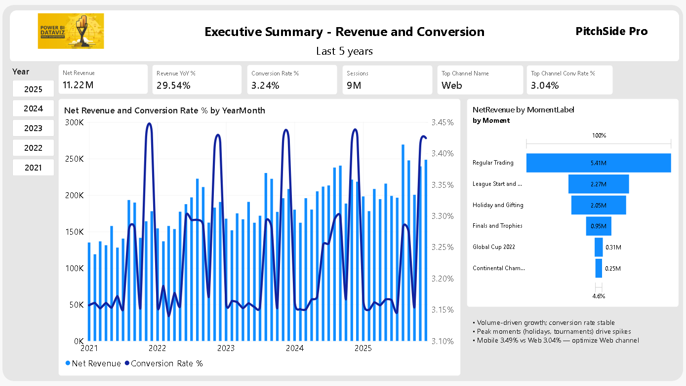
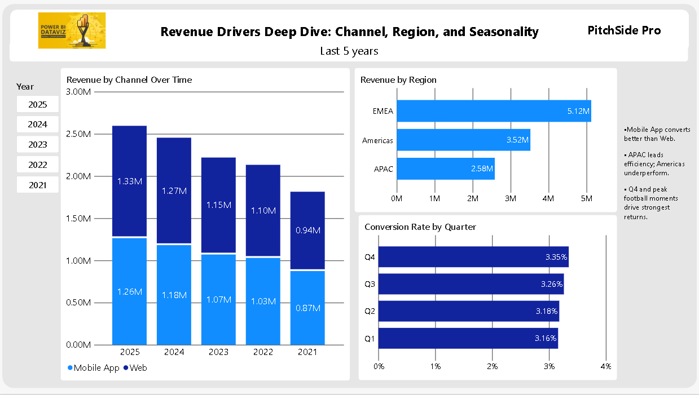
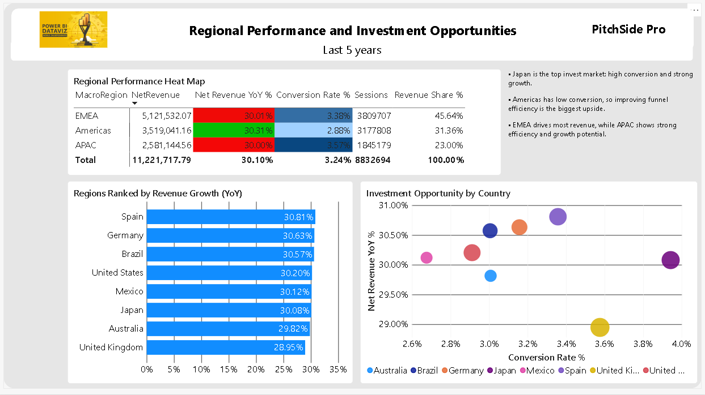
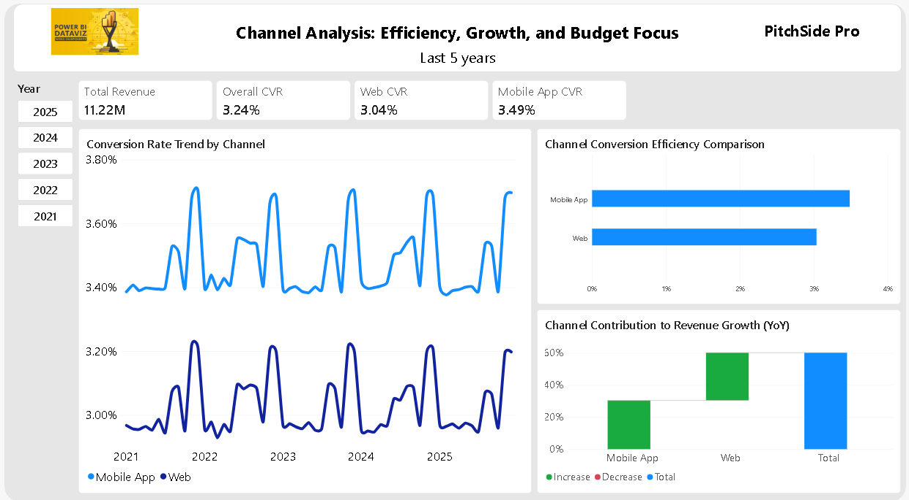
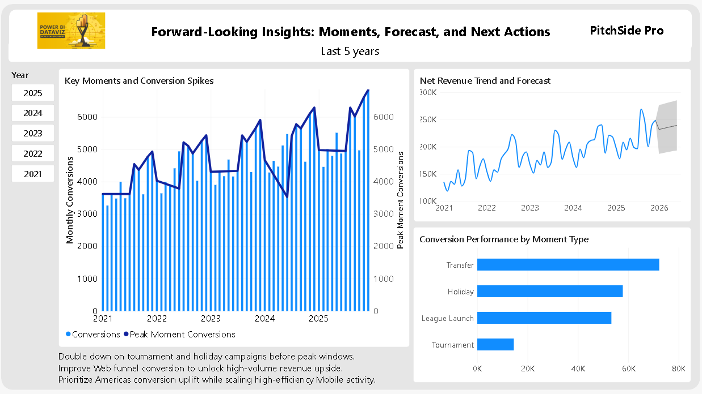

# PitchSide Pro Revenue Performance Dashboard

This repository contains a Power BI project created for the Dataviz World Champs (Round 1).

## Project Goal

Answer the executive question:

What is driving changes in revenue performance over time, and where should the business focus next to sustain growth?

## Repository Contents

- `Dataset/`: Source CSV files used in the project.
- `PowerBI/`: Final Power BI report file (`.pbix`).
- `images/`: Dashboard screenshots (page-level captures).
- `ExplanationFolder/contest.txt`: Original challenge brief.

## Power BI File

- Main report: `PowerBI/World Champs BCN 26 - Dashboard.pbix`

## Dashboard Pages Included

The dashboard is organized into 5 executive-facing pages:

1. **Executive Summary**
   - Top-line performance view
   - Key KPI cards and trend overview

2. **Revenue Drivers**
   - Core factors driving revenue changes over time
   - Focus on contribution and performance patterns

3. **Regional Performance**
   - Comparison of performance by region
   - Geographic opportunities and underperformance signals

4. **Channel Analysis**
   - Channel-level performance breakdown
   - Efficiency and conversion-focused insight

5. **Forward-Looking Insight**
   - Trend direction and strategic focus areas
   - Recommendations to sustain growth

## Dashboard Screenshots

### Executive Summary

### Revenue Drivers

### Regional Performance

### Channel Analysis

### Forward-Looking Insight

## Tools

- Power BI Desktop
- CSV data model with dimension and fact tables

## Notes

- The `.pbix` file is included in this repository.
- Screenshot files are included to document what is inside the dashboard pages.
